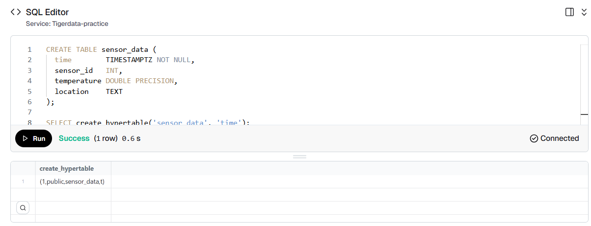
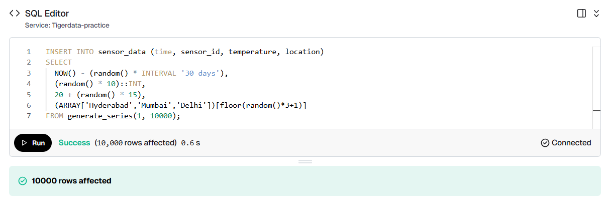
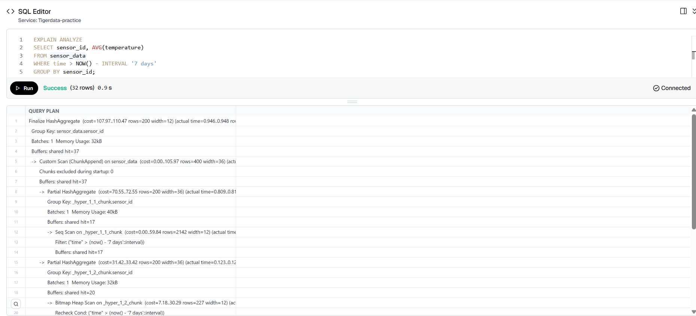
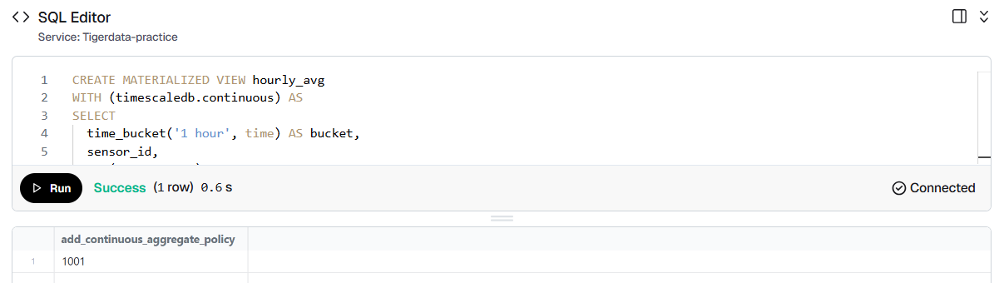
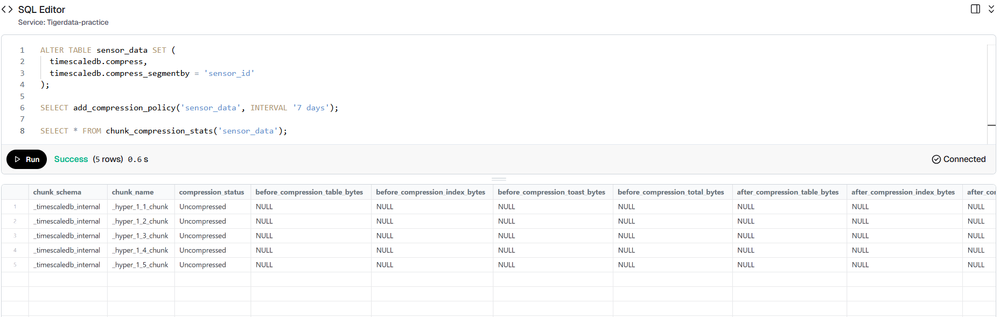

# TimescaleDB Exploration on Tiger Cloud

This repository documents my hands-on exploration of TimescaleDB the time-series extension built on PostgreSQL that powers Tiger Data's platform. I set this up on Tiger Cloud to understand how it works in a real environment,
not just from documentation.

PostgreSQL 18.3 · TimescaleDB v2.26.2 · Tiger Cloud (AWS) · April 2026

---

## Why I built this

Tiger Data's platform is built on TimescaleDB, and I wanted to go beyond
reading docs. I spun up a real service on Tiger Cloud, loaded sensor data,
and worked through the features that matter most in a support engineering
context — execution plans, chunk behavior, compression, and continuous aggregates.

Everything here is something I ran myself and understood before writing about it.

---

## Environment

- **Platform:** Tiger Cloud (AWS us-east-1)
- **PostgreSQL:** 18.3
- **TimescaleDB:** v2.26.2 (latest)
- **Interface:** Tiger Cloud Web SQL Editor

---

## What I explored

### Setting up a Hypertable

The first thing TimescaleDB asks you to do differently is convert your table into a hypertable. It looks like a regular table from the outside, but internally TimescaleDB partitions it into time-based chunks automatically.

```sql
CREATE TABLE sensor_data (
  time        TIMESTAMPTZ NOT NULL,
  sensor_id   INT,
  temperature DOUBLE PRECISION,
  location    TEXT
);

SELECT create_hypertable('sensor_data', 'time');
```



The result `(1,public,sensor_data,t)` confirmed the hypertable was created in the public schema. From this point, every INSERT is automatically routed into the right time chunk by TimescaleDB — no manual partitioning needed.

---

### Loading realistic data

I generated 10,000 rows simulating IoT temperature sensors across three Indian cities over a 30-day window.

```sql
INSERT INTO sensor_data (time, sensor_id, temperature, location)
SELECT
  NOW() - (random() * INTERVAL '30 days'),
  (random() * 10)::INT,
  20 + (random() * 15),
  (ARRAY['Hyderabad','Mumbai','Delhi'])[floor(random()*3+1)]
FROM generate_series(1, 10000);
```



10,000 rows inserted in 0.6 seconds. TimescaleDB spread this data across 5 chunks automatically based on time ranges.

---

### Reading an execution plan

This is the part I found most valuable. Running EXPLAIN ANALYZE on a time-filtered query shows exactly how TimescaleDB handles it differently from regular PostgreSQL.

```sql
EXPLAIN ANALYZE
SELECT sensor_id, AVG(temperature)
FROM sensor_data
WHERE time > NOW() - INTERVAL '7 days'
GROUP BY sensor_id;
```



**What I noticed in the plan:**

- `Custom Scan (ChunkAppend)` — TimescaleDB only scanned chunks that fall within the 7-day window. Older chunks were skipped entirely.
- The data lived in `_hyper_1_1_chunk` and `_hyper_1_2_chunk` for the recent window, with a Bitmap Index Scan on the time index.
- **Execution time: 1.050 ms** — fast because irrelevant chunksnever got touched.
- **Planning time: 0.730 ms**

This is chunk exclusion in practice. On a table with months or years of data, this difference becomes enormous.

---

### Continuous Aggregates

Continuous aggregates are pre-computed materialized views thatauto-refresh on a schedule. Instead of re-aggregating millions of rows every time a dashboard loads, the work is done incrementally in the background.

```sql
CREATE MATERIALIZED VIEW hourly_avg
WITH (timescaledb.continuous) AS
SELECT
  time_bucket('1 hour', time) AS bucket,
  sensor_id,
  AVG(temperature) AS avg_temp,
  MAX(temperature) AS max_temp
FROM sensor_data
GROUP BY bucket, sensor_id;

SELECT add_continuous_aggregate_policy('hourly_avg',
  start_offset => INTERVAL '3 days',
  end_offset   => INTERVAL '1 hour',
  schedule_interval => INTERVAL '1 hour');
```


Policy ID `1001` was created successfully. Querying the view returned clean hourly buckets per sensor with avg and max temperatures all pre-computed, not re-calculated on each query.



---

### Compression

TimescaleDB compresses older chunks into a columnar format, which significantly reduces storage while keeping recent data uncompressed and fast to query.

```sql
ALTER TABLE sensor_data SET (
  timescaledb.compress,
  timescaledb.compress_segmentby = 'sensor_id'
);

SELECT add_compression_policy('sensor_data', INTERVAL '7 days');
SELECT * FROM chunk_compression_stats('sensor_data');
```



The stats showed all 5 chunks as `Uncompressed` which is correct. The policy compresses chunks older than 7 days, and since my data was just inserted, nothing had aged out yet. This is exactly how you'd explain it to a customer who
wonders why compression hasn'tkicked in right after setup.

`compress_segmentby = sensor_id` groups rows by sensor before compressing, which improves both the compression ratio and query speed when filtering on sensor_id.

---

## What I took away from this

**Chunk exclusion is the real story.** The performance advantage of TimescaleDB comes from time-based partitioning that lets the planner skip irrelevant data entirely. Once you see it in an execution plan, it's immediately obvious
why this matters at scale.

**Continuous aggregates shift cost from query time to background time.**
This is the right architecture for any analytical dashboard compute once, serve fast.

**Compression is thoughtful.** The segmentby design shows that TimescaleDB compression isn't just "make it smaller" it's structured to preserve query patterns.

**The support engineering challenge here is interesting.** Most customerissues will come from misunderstanding chunk behavior, not configuringcompression policies correctly, or expecting continuous aggregates tobe real-time. Having worked through the setup myself, I can seeexactly where those confusion points would arise.

---

## Resources

- [Tiger Data Docs](https://docs.tigerdata.com)
- [Real-time Analytics Tutorial](https://docs.tigerdata.com/tutorials/latest/real-time-analytics-transport/)
- [Tiger Cloud Console](https://console.cloud.timescale.com)
